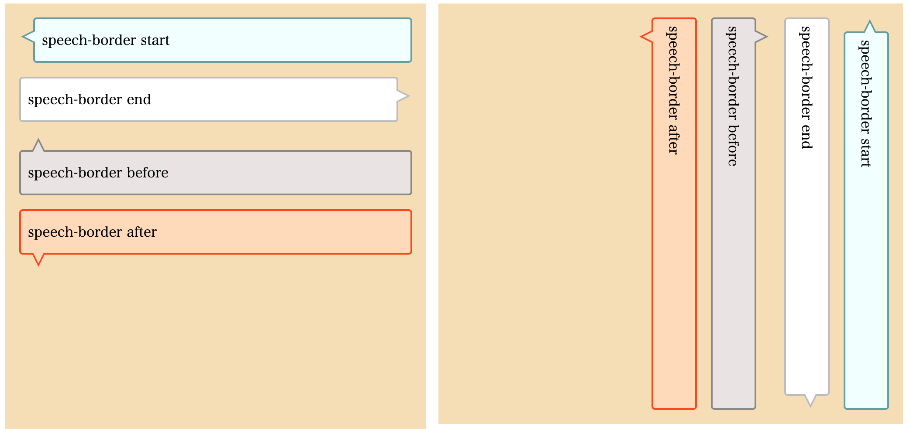

# nehan-speech-border

[nehan](https://github.com/tategakibunko/nehan) plugin to display border for speech balloon.



## create nehan style

```typescript
import * as SpeechBorderStyle from 'nehan-speech-border';
const speechBorderStyle: CssStyleSheet = SpeechBorderStyle.create({
  selector: ".speech-border",
  direction: "start", // "start" | "end" | "before" | "after"
  borderColor: "#ccc",
  bgColor: "white",
  borderSize: 2,
  borderRadius: 4,
  triangleOffset: 12,
});
const pd = new PagedNehanDocument("<div class='speech-border start'><div class='content'>this is content text</div></div>", {
  styleSheets:[
    speechBorderStyle, // use style!
  ]
});
```
